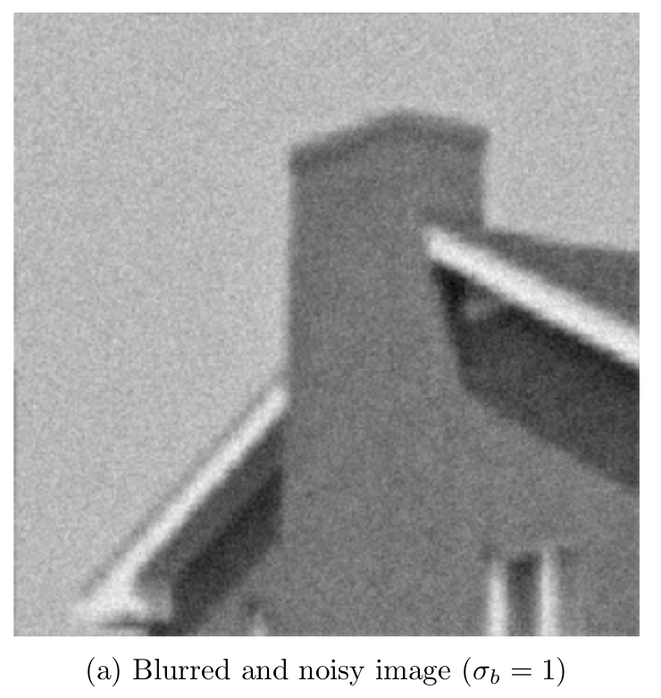
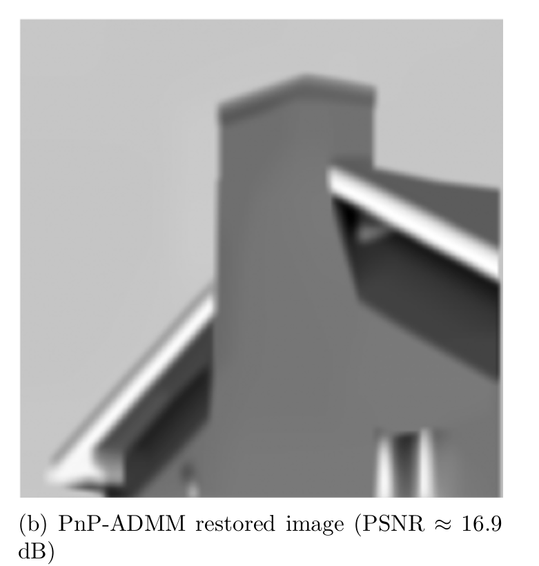
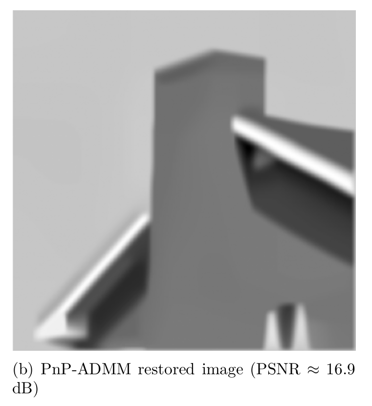

#  Plug-and-Play ADMM

This repository presents an implementation of **Plug-and-Play ADMM (PnP-ADMM)** for image restoration, focusing on **denoising and deblurring under varying noise levels**. The project demonstrates how modern denoisers can be integrated into optimization-based imaging pipelines.

This work is suitable for **computational imaging, inverse problems, and edge/FPGA-oriented research**.

---

## 🧠 Background

Many image restoration problems can be written as:

\[
\min_x \; f(x) + g(x)
\]

where:
- \( f(x) \) is the data fidelity term
- \( g(x) \) is a regularization prior

### Plug-and-Play ADMM

PnP-ADMM replaces the explicit prior with a **denoising operator**, enabling powerful implicit priors without defining \( g(x) \) analytically.

---

## 🔁 PnP-ADMM Algorithm

At iteration \( k \):

1. **Data fidelity update**
\[
x^{k+1} = \arg\min_x f(x) + \frac{\rho}{2}\|x - z^k + u^k\|^2
\]

2. **Denoising (Plug-and-Play step)**
\[
z^{k+1} = \mathcal{D}_\sigma(x^{k+1} + u^k)
\]

3. **Dual update**
\[
u^{k+1} = u^k + x^{k+1} - z^{k+1}
\]

---

## 🖼️ Experimental Results

### 🔹 Case 1: Moderate Blur and Noise (σᵦ = 1)

| Input (Blurred + Noisy) | PnP-ADMM Restored |
|------------------------|-------------------|
|  |  |

**PSNR ≈ 16.9 dB**

---

### 🔹 Case 2: Stronger Blur and Noise (σᵦ = 3)

| Input (Blurred + Noisy) | PnP-ADMM Restored |
|------------------------|-------------------|
|  |  |

**PSNR ≈ 16.9 dB**

---

## 📊 Observations

- PnP-ADMM significantly improves visual quality under heavy noise
- Edge structures are preserved despite strong blur
- The framework is robust to increasing noise variance
- Denoiser choice directly affects convergence and quality

---

